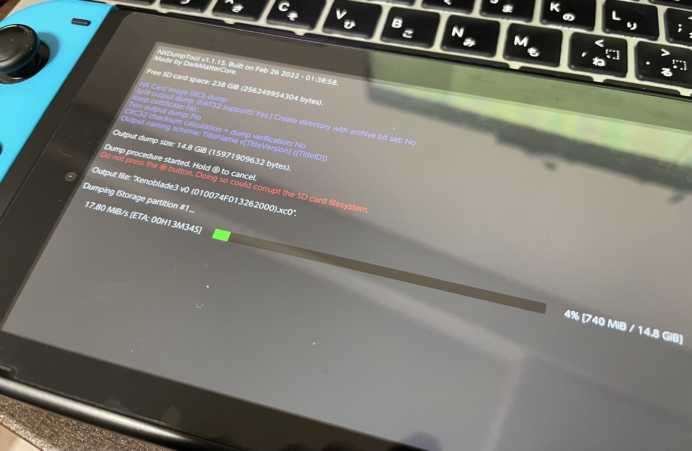
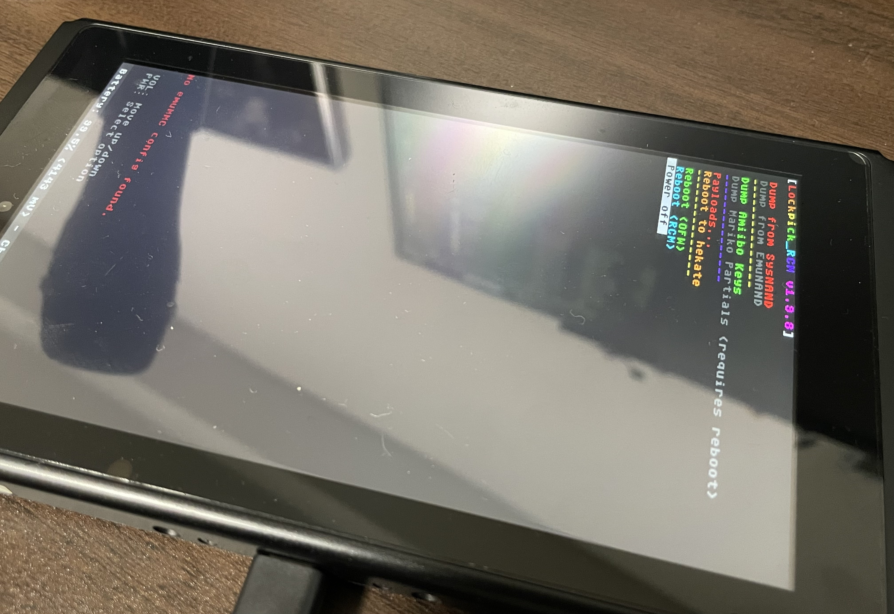
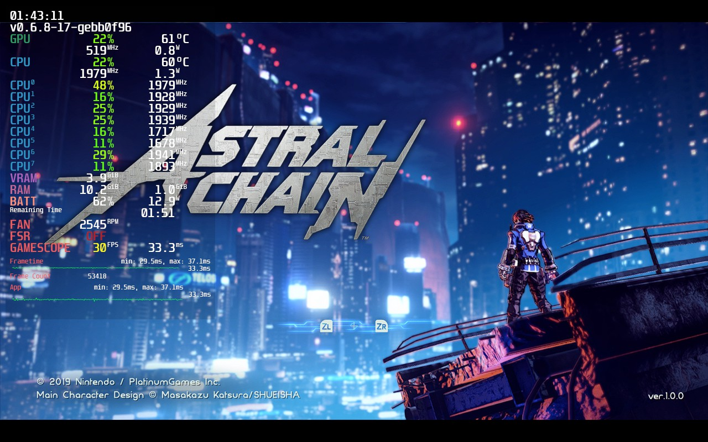
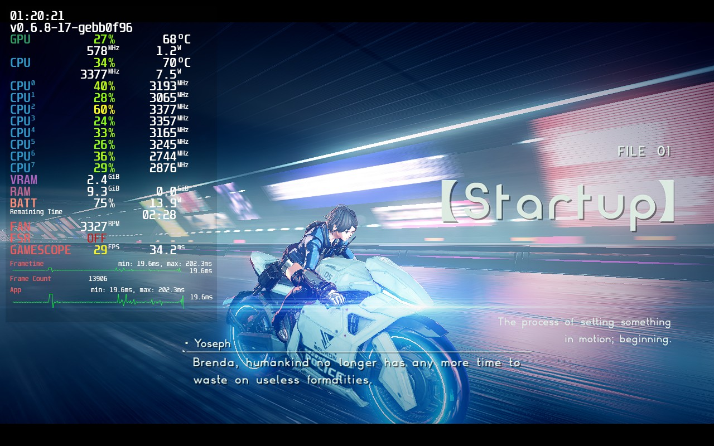
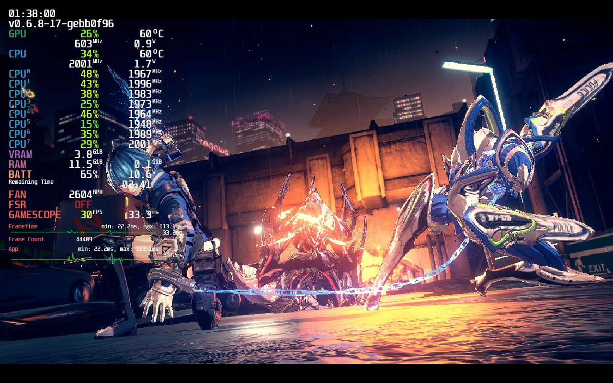
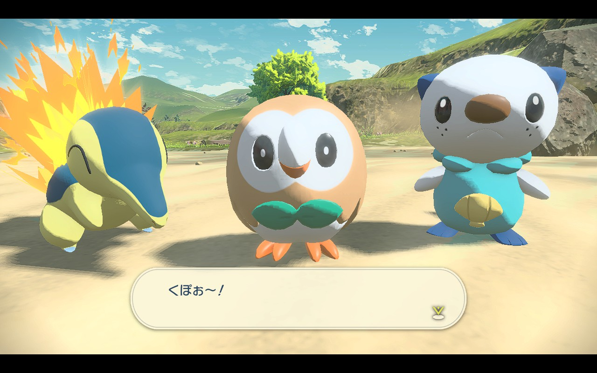
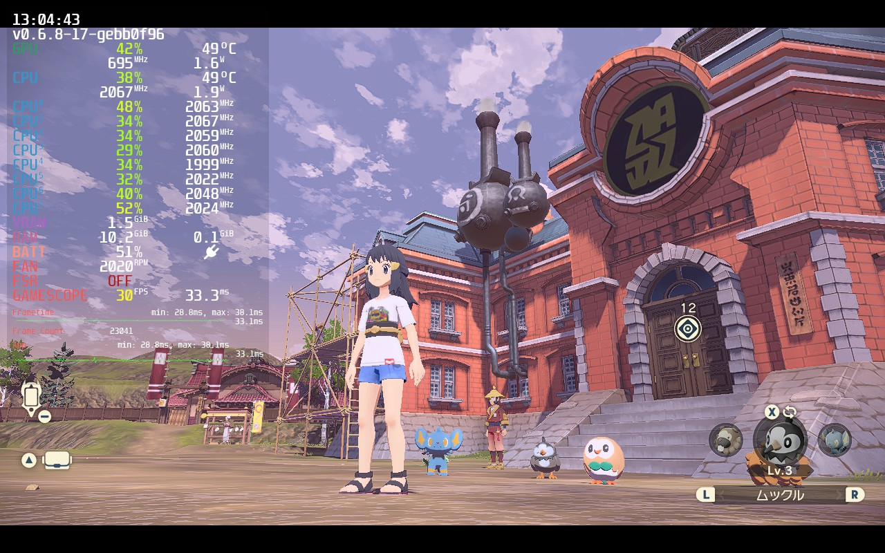
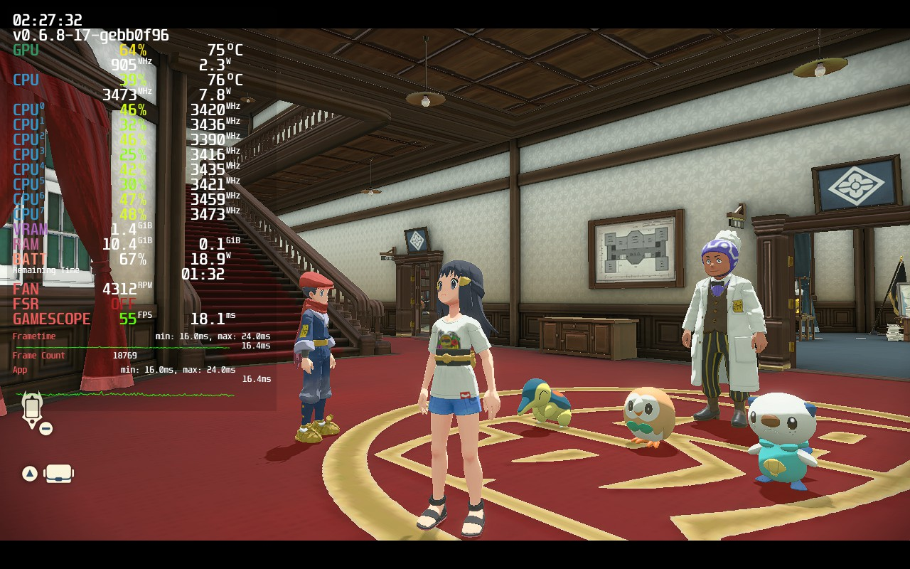

## 『yuzu』 とは？

> yuzu is an experimental open-source emulator for the Nintendo Switch from the creators of Citra.
> It is written in C++ with portability in mind, with builds actively maintained for Windows and Linux.
> 公式 HP から引用

## 動機

SteamDeck を買ったのはいいもの、単純に Steam のゲームをプレイするばかりで、ガジェットとして遊んだこととしては、Epic Game Store のゲームをインストールしてするぐらいしかしておらず、こんなガジェットがあるのだから、**もう少し弄り倒してみたい**という気持ちがあった。そこでふと SteamDeck 関連の YouTube 動画を見ている中で、SteamDeck で動作する [yuzu](https://yuzu-emu.org/) のパフォーマンスについて紹介しているものがあり、実機と遜色ない実行速度・クオリティーだったので、興味を惹かれ試してみようと思ったのが動機です。

## 過程

手順を紹介しているサイトは探せばすぐ見つかるので、手順は紹介せずに、備忘録や自分以外の人がハマらないように、苦労したことや、引っかかったことを残しておく。注意しておくと、何か**ネットを参考に作業する際は複数のサイトを参考にすること**。特定のサイトだけを見て作業すると、情報が古かったり、ハマりどころが解説されていなかったりなど、抜け漏れが発生しがちです。また、**ゲームのバックアップ起動はあくまでも個人の範囲で楽しむことを前提にしてください**。

### 用意した物

- 初期型 Nintendo Switch (発売日に買ったやつ)
- MicroSD 256GB (3000~4000 円)
- RCM ジグ (500 円)

### Fat32 問題

MicroSD は SteamDeck に挿す MicroSD を 1TB のものに変更したので、そのお下がりを用意した。この容量であれば十分。しかしながら、Switch の CFW 導入においては、(Large) Fat32 にフォーマットする必要があるらしい。幾つかのサイトでは、Fat32 でフォーマットしないとエラーになってしまう可能性が高いと注意書きされている。しかし、自分がしたいのは、ゲームカードのデータの吸い出しであって、それ以上ではないので逆に困る。理由としては簡単で、ゲームカードのデータが 4GB 以上になり、吸い出した際にファイルとして扱えないためです。吸い出しツールとして鉄板である [nxdumptool](https://github.com/DarkMatterCore/nxdumptool) には Fat32 向けに分割で吸い出す設定があり、吸い出したファイルは別途結合する必要がありました。分割ファイルをどう結合すればいいのか分からなかったのですが、どうやら汎用の結合ツールで特に問題ないらしい。

### EmuDeck のインストール問題

[EmuDeck](https://www.emudeck.com/) では様々な機種のエミュレーターを SteamDeck にインストールすることができますが、自分は yuzu にしか興味はなかったので、インストールオプションの時に yuzu 意外を全てブラックアウトしたのですが、それだと Rom のマネジメントを行うツールである Steam Rom Manager が正しく動作しないという罠を踏みました。グレーアウトした中に Steam Rom Manager に必要なコンポーネントが含まれているので、忘れずにインストールしましょう。

### SteamDeck への転送問題

SteamDeck で MicroSD をフォーマットした場合、ext4 でフォーマットされており、それを Windows PC に刺したところで単純には認識できないという問題を踏みました。読み書きできるようにすることは可能そうだが、一般的ではなく多少めんどくさそうに見えたので、SFTP でファイル転送するようにしました。接続自体は同じ Wifi 環境下にあればあっさりだし、下手な SD カードリーダとか使っている場合は SFTP の方が転送速度も速かったりするので、おそらくこっちのほうが全体的には楽だと思う。Switch についても同様のことができるみたいですが、 Siwtch は吸い出すだけの役割なので特に設定しませんでした。ここらへんは SteamDeck が SteamOS (Linux ベース) であることの利点ですね。sshd を通信するタイミングだけ動かしておけば、SFTP でファイル転送できるのは非常に楽です。

### 参考にした記事

以下を参考にしましたが、実際に試される際は他のサイトとかも回って総合的に確認した方がいいです。

- [2023 年最新版改造 CFW！ニンテンドスイッチ...](https://pcgamer-12.com/archives/289)
  - 基本的な説明がある記事。最新って書かれると安心するけど、同時になんか騙されてる感ある。
- [Steam Deck の Tips! FTP 経由で内蔵の microSD カードにデータをコピーする方法](https://retro-gamer.jp/?p=23485)
  - SFTP でデータ転送する方法が書かれている記事。SSH が何か説明してないところがなんとも改造記事らしい。
- [ニンテンドースイッチ　キーを取得する Lockpick のペイロード版 Lockpick_RCM 紹介](https://yyoossk.blogspot.com/2019/03/lockpicklockpickrcm.html)
  - yuzu を動かすのに必要なキー情報を取得するための方法を紹介する記事。
- [Steam Deck で何かの時に役に立つかもしれないいくつかの Tips](https://retro-gamer.jp/?p=23861)
  - ゲーム以外のスクリーンショットはアップロードできない理由を調べてて発見。

## 感想

自分が試したソフトは、[ASTRAL CHAIN](https://www.nintendo.co.jp/switch/ab48a/index.html)、 [ポケモン LEGENDS アルセウス](https://www.pokemon.co.jp/ex/legends_arceus/ja/)、[Xenoblade 3](https://www.nintendo.co.jp/switch/az3ha/index.html) で、どれも買ったいいものの Switch で起動してない、または起動したけど初めの少ししか遊んでおらず、棚にパッケージソフトがアートとして飾ってあったソフトたちです。**ゲームは遊んでなんぼ**なんですが、時間が取れずに放置してしまった一人用ソフトです。自分は SteamDeck を中心にゲームライフを組み立てていく方針なので、せっかくなのでこれらのソフトも入れて、遊べたらいいなという思いからチョイスしました。前者の２つについて動作について説明しています。

### ASTRAL CHAIN

動く！！ まずそこに感動。結構激しめのアクションゲームではあるのですが、30FPS 安定して出ます。画面が派手に変わるシーン (爆発等) はちょっとカクつきを感じますが、アクションパートも含めて、**十分にストレス無く遊べるレベルといって問題ないレベルでした**。CPU, GPU 共にまだ余裕は十分感じられる使用率で、Steam でファンがすごい勢いで回る、ということもありません。最初のイベントシーンで音のズレを多少感じましたが、雰囲気を致命的に壊す訳でもないので許容範囲内です。

バイクに乗って、高速に移動しているシーンになりますが、安定して 30FPS が出ています。(左のエリアは SteamDeck のパフォーマンスモニタになっていて、現在の GPU, CPU の使用率や温度、画面の FPS の数値、ファンの回転数等を確認することができます) 更に言えば、30FPS が出ていてもまだ SteamDeck 的には余裕がありそうな使用率になってます。

### ポケモン LEGENDS アルセウス

このタイトルもすんなり動作しました。こちらはオープンワールドゲームで、それなりに処理が重いゲームのハズだが、ASTRAL CHAIN に比べて、全体的に少しだけ使用率が上がった程度で安定して 30FPS が出ていました。むしろこちらの方がゲームシーンが激しく移り変わらないため、FPS の低下もあまり見られず安定している気がします。グラフィックについて、遠くの煙が荒ぶってたりと明らかな問題が確認できたが、少しだけプレイした感触では進行にまつわる問題には当たっていないので、特に問題はなさそうに見えます。

yuzu は MOD にも対応していて、有志が公開しているパッチを当てて、60FPS 動作にしてみたところの画像。見ての通り、30FPS を超えて 55FPS が出ています。一方で、軽めのシーンにおいても結構な GPU, CPU 使用率になってしまい、ファンが高速回転しています。動作もちょっと不安定になる部分もあり、電池の持ちも微妙になってしまいそうなので、SteamDeck をフルで使うことを目的に導入してみた MOD ですが、常用するのはちょっと難しそうな感じです。

### まとめ

とにかく Switch のゲームが SteamDeck 上で動くことに感動した。一人用のゲームはどうしても後回しにしがちなので、SteamDeck で合間時間でゲームをプレイして、インプットを強化していきたい。
