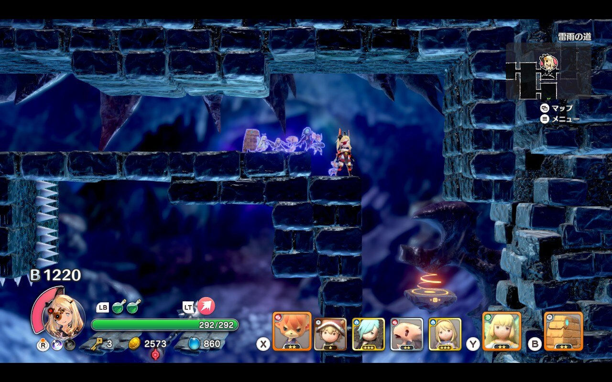
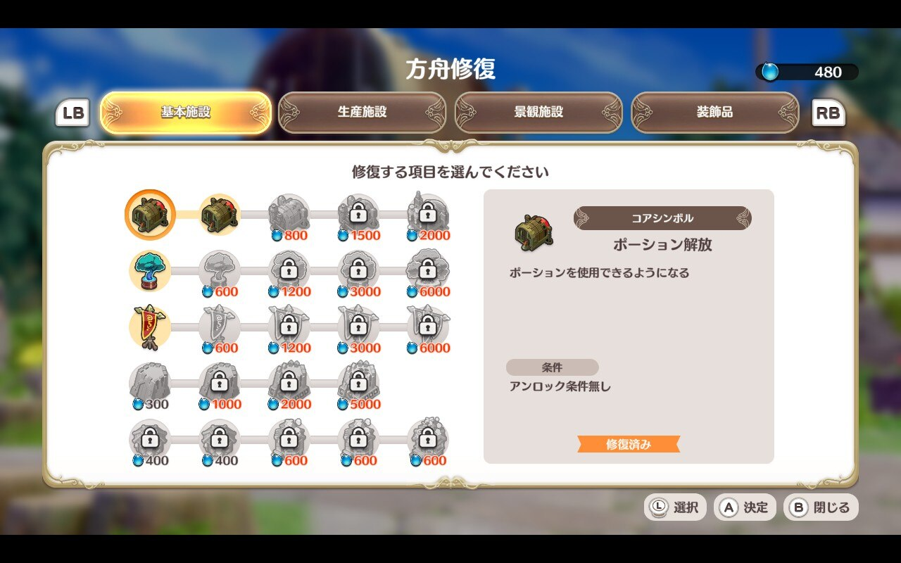

## 『リトルノア楽園の後継者』 とは？

**2022/6/28 発売**

> 『リトルノア楽園の後継者』は横スクロールのローグライトアクションゲームです。はじめてのローグライトを楽しく爽快なアクションで遊んでいただけるように作られています。主人公ノアを操作し、「アストラル」と呼ばれるユニークな攻撃アクションを持った仲間を率いて、入るたびに構造が変わる謎の古代遺跡ダンジョンを冒険しましょう。
> (NintendoSwitch ストアページから)

## 感想

2D 横スクロールローグライトアクションゲームで、類似ゲームとして有名どころでいえば、[Dead Cells](https://store.steampowered.com/app/588650/Dead_Cells/?l=japanese) などが挙げられる。本ゲームは死んだらダンジョンで手に入れた装備等が換金され、それを用いてキャラのパッシブ能力を永続強化できる、というシステムを採用していて、強くなっていくことを実感できます。プレイする度にダンジョンで手に入れた内容を元にビルドを考えて戦っていくという、**ローグライトならではの要素をカジュアルに楽しむことができるのが何よりの特徴**で、そのエッセンスをしっかり楽しめるという意味では十分に面白い。

一方で、アクション難易度はちゃんと負けるように設計されており、ノーマルでも十回以上はダンジョンに潜り直す必要が出てくると思う。ザコ敵のバリエーションが多彩な一方で、ボスがややワンパターンなのでそこがちょっとつまらない。ダンジョンやり直しの度にボスと戦うことになるのだが、相手によっては道中よりボスのほうが安定したりする。ボスの武器にバリエーションをもたせるなどの工夫も見られるが、動きはほぼ変わらないので、もう少しボスに工夫が欲しかったと思う。

### 得点: 8/10

類似の作品に比べて難易度は低めに思えるが、そこも含めてやり直しのストレスを感じさせにくい仕組みになっていて、ボスの攻略方法も含めて自分で成長していく過程も実感ができて手応えも良い。全体的なボリュームは抑えめだが、体験に絞って考えれば、丁度良い塩梅だと言えると思う。自分で遊ぶ価値も含めて、**全体的に満足度の高い作品**だった。

### プレイ時間: 9 時間

プレイ時間としては、ゲームの値段も考えると妥当。ボス毎に壁があり、ちゃんと動きをみて攻略するという手順を踏んでいく過程が、そのままプレイ時間になっていく。ラスボスまでたどり着いてから、倒すのに三時間以上かかってしまったが、そこがこのゲームの一番の継続の壁になりそうに思える。

### プレイする価値: 5/5

実際にプレイしないと、ゲームとしての面白さが分からないタイプの作品。ローグライクとして自動生成されるダンジョンと、そこに落ちているアイテムの組み合わせを考えて攻略していく楽しさは、**自分で考えてプレイすることに真価がでて面白さを実感できる**のではないかと思う。**アクションの手応えも良い**ので、是非触ってもらいたい。

### ストアリスト

PC (Steam) 版を、 SteamDeck でプレイしました。スペックが要求されるゲームではないので、Switch で遊ぶのが一番体験が良さそう。

- [Steam](https://store.steampowered.com/app/1883260/_/?l=japanese)
- [NintendoSwitch](https://store-jp.nintendo.com/list/software/70010000049101.html)
- [PlayStation](https://store.playstation.com/ja-jp/product/JP0178-CUSA31684_00-LNJP000000000001)

### スクリーンショット

