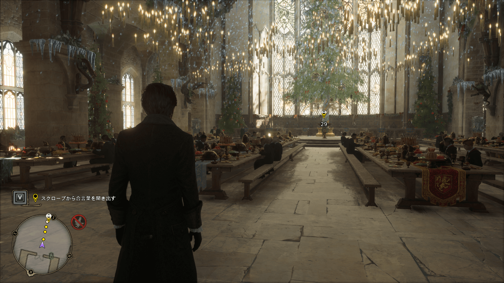
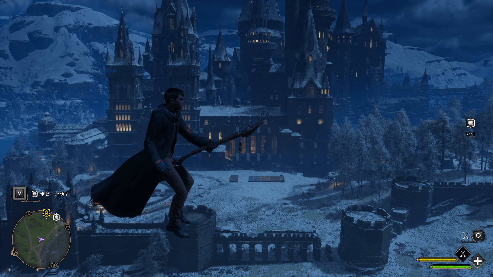
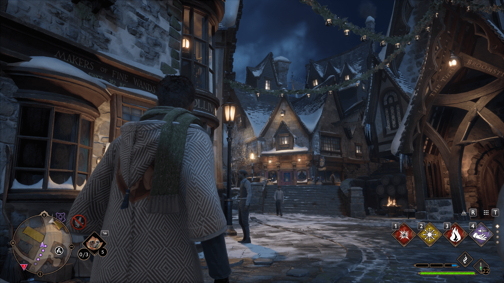
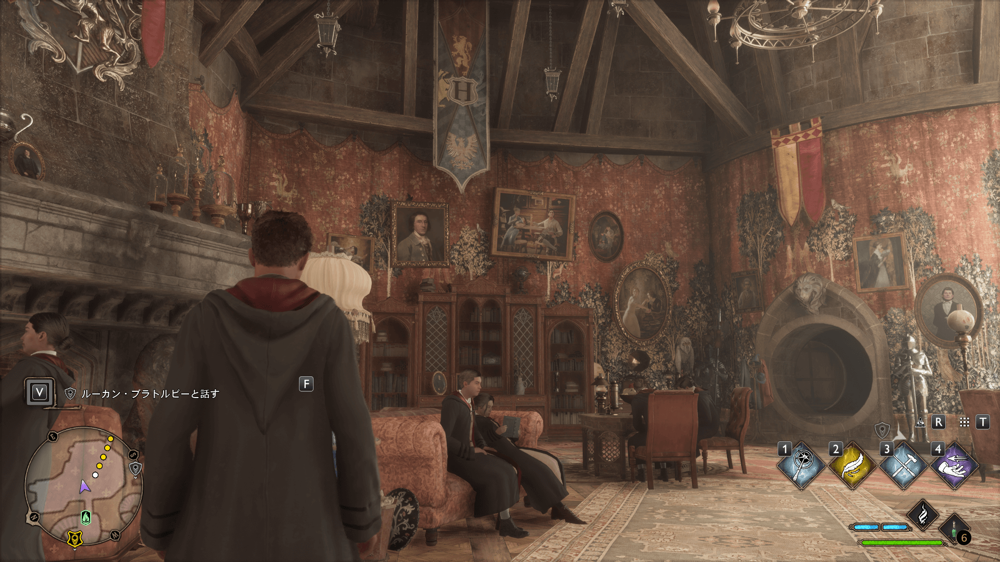
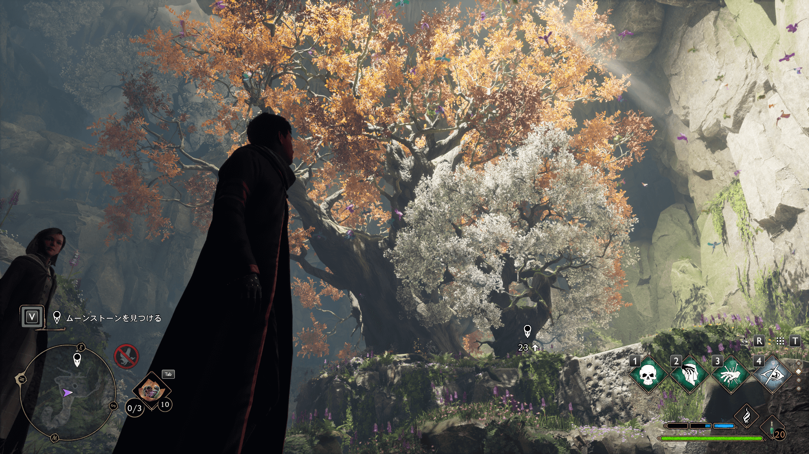
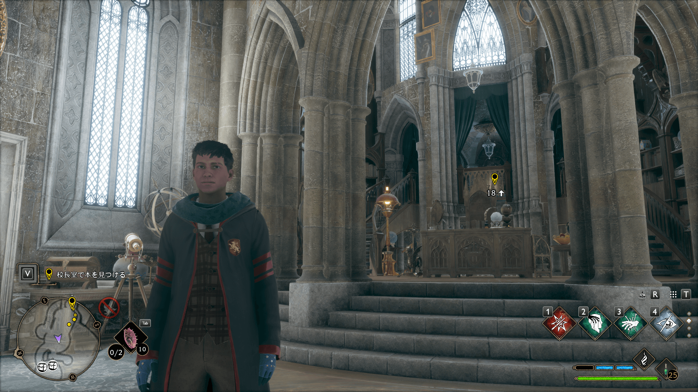
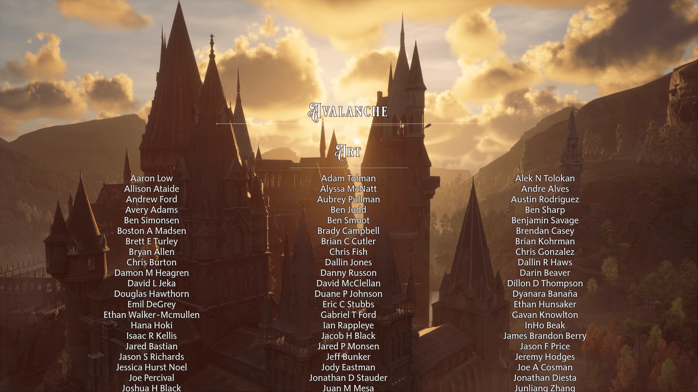

## 『ホグワーツ・レガシー』 とは？

**2023/2/10 発売**

> 『ホグワーツ・レガシー』は、アヴァランチ・ソフトウェア制作・ワーナー・ブラザーズ ゲームから発売されたアメリカ合衆国のオープンワールドアクションロールプレイングゲームである。J・K・ローリングの『魔法ワールド』のホグワーツ魔法魔術学校を舞台としている。
> Wikipedia

## 感想

ハリーポッターシリーズでおなじみの、ホグワーツ魔法魔術学校を舞台にした、オープンワールドゲーム。レガシーの名の通り、ハリーポッターの時代以前のホグワーツのストーリーを体験できる。主人公はホグワーツに 5 年生として入学し、学友と様々な体験をしていく、というもの。ゲームの導入は素晴らしく、**世界観を良くゲームで表現**できていて、今後のゲーム体験に胸踊らせる内容。順次覚えておく魔法と共に、戦闘体験だったりギミックが増えていき、**まさにオープンワールド RPG** という形の体験を再現してくれる。

### 得点: 9/10

このゲームで一番大事なことは、**ハリーポッターの世界を探検できる**ということで、それは非常に良く再現されている。原作にも存在する魔法や、箒を使い世界を飛び回る快感、ヒッポグリフに乗って駆け回る興奮、ホグズミードにあるお店の再現度。どれをとってもまさにと唸るものであり、冒険が進むについれて変わる季節とともに見せる表現も含め、開発陣の強いこだわりを感じることができる。ゲームにおける戦闘についても、各種魔法を組み合わせたコンボや、魔法植物を使った補助、闇の魔法など、適度に歯応えのある敵の配置を合わせて、緊張感と達成感を与えてくれる。全体として非常に完成度の高いオープンワールドゲームだと言えると思う。

**闇の魔術**については、基本的に打ち放題で特にデメリットも無いが、非常に強力なため、ゲームの戦闘体験がガラリと変化してしまうことには注意が必要かもしれない。戦闘にしっかりとした歯応えが必要だと思うのであれば、**使わないという選択肢**もある。闇の魔術はその攻撃を放つと、相手の攻撃モーションを必ず中断し、かつ相手のバリアを (何色でも) 必ず破壊して、その効果を与える。相手のバリアの色を見て呪文を選んで戦うという、戦闘の基本を問答無用でぶっ壊してくる。逆に言えばその**全能感みたいなのが楽しい**。とはいえ、ゲームの楽しみ方は人それぞれ。

オープンワールドとして優れているかと言われたら、雰囲気を出すことには成功しているが、それ以外についてははっきり言って微妙といえる。オープンワールドとして本格的に世界を巡れるようになるタイミングで、箒を手に入れられて、空を自由に飛び回れるようになってしまうため、世界をどのように見てほしいかの導線みたいなのを無視できてしまう。簡単に言えば、箒を使えばどこにでも行けてしまうし、どのような手順でも行けてしまうのである。「原神」におけるモンドから旅をして璃月を望む時のような、こう世界を旅すると素敵に見えるだろうという、開発側からの誘導が働かない。そのため適当にワープポイントを順に空から降りて開放する、という単調な体験になってしまう。本当に惜しいと思う。ギミックや敵の種類が少ないことについてもやや残念に思う部分ではあるが、ストーリーの短さもあって、そんなものだろうと思う。DLC 等に期待したい。

あと、ストーリーの底の浅さについてはかなり気になった。ストーリー展開は想像の外を出なかったし、途中で守護者の試練といって、ポケモンでいうジム巡りで記憶集めみたなことをさせられるが、守護者本人が言うほどその必要性を感じない。どちらかというと、ゲームボリュームを盛るためのストーリー展開のようで、悪意が迫っているというのにあまりに悠長している感じがある。親友として 3 人存在し、各々つながったサブストーリーが存在するが、それらについてもどことなくスッキリしない結末であることが多い。悪事の証拠を頑張って集めたのに、結局殴り込みにいくのはあまりにゲーム的でやや萎える。サブクエストについては、シナリオを読んでいる時間が苦痛な事が多い。例にもれず基本的にはお使いなので、ストーリーは流しながら、サブクエストの戦闘を楽しんだりするのが良い。まあ、そこにはそもそも期待していないので、そんなものだろうという感想。

ちょっと厳し目の意見を書いたが、全体として一番大切な体験をしっかり再現できていることが何よりの評価点であると思うので、得点としては 9 点としたい。本当に楽しい体験だったと。次に USJ のハリーポッターエリアに行ったら、別の見方ができそうな気がする。

### プレイ時間: 40 時間

サブクエストは、親友関連のものとその他有用そうなものを一通りで、大体 70% 程度でラスボスまでプレイすると自分は 35 時間ぐらいかかった。やや適当に探索を行っている時間もあり、レベルは 32 でラスボスを倒した (Max 40)。しかし、エンドロールを見るには、34 必要なので、その後少しサブクエストをこなして、全体として 40 時間程でエンドロール見ることができた。サブクエストを全部と、オープンワールドを隅々まで探検するともっと時間はかかりそうだが、そこまでプレイしたいという気持ちにはならなかった。メインストーリーを終えてこれ以上楽しい体験はないだろう、という気持ちになってしまったのが大きい。クリア後には別に少しやることがあればいいなという気持ち。

### プレイする価値: 4/5

是非プレイして、その世界を堪能して欲しいと思う。特に、ハリーポッターシリーズのファンであれば、絶対に楽しめると思う。シナリオはあってないようなものなので、配信とかで見ていても、実際にコントローラーを手に持って、**様々な呪文を唱えて敵を倒していく体験をして欲しい**と思う。おそらくオープンワールドゲームとしては、プレイ時間はやや短めだと思うので、忙しい人も是非。

### ストアリスト

PC (Steam) 版をプレイしました。スペックが要求されるゲームなので、PC スペックが微妙な人は注意。SteamDeck でもプレイ可能とありますが、30fps で画面も荒れてるので、体験としてはかなり微妙になってしまう (美しくも怪しい世界を楽しむのが重要なので)　のでオススメはできません。

- [Steam](https://store.steampowered.com/app/990080/_/?l=japanese)
- [PlayStation](https://www.playstation.com/ja-jp/games/hogwarts-legacy/)
  - [Amazon PS5](https://amzn.to/3INqcdK)
  - [Amazon PS4 (予約 4/4 発売)](https://amzn.to/3lR7usG)
- NintendoSwitch 版は今後登場予定

### スクリーンショット

