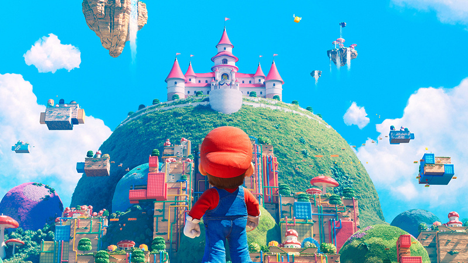
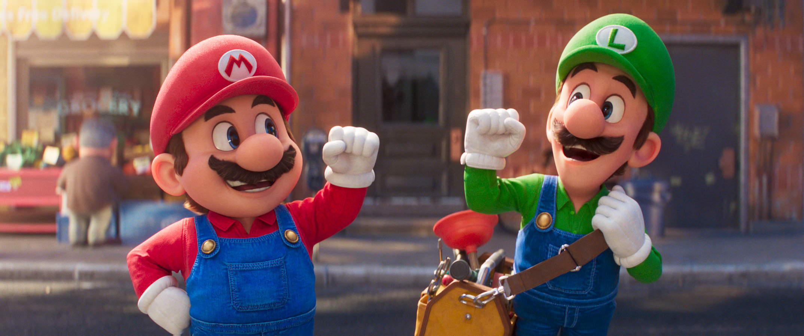

## 『ザ・スーパーマリオブラザーズ・ムービー』 とは？

> 『ザ・スーパーマリオブラザーズ・ムービー』は、日米合作による 2023 年のコンピュータ・アニメーション映画。任天堂のゲーム『スーパーマリオ』シリーズを原作として、任天堂とユニバーサル・ピクチャーズが共同出資し、任天堂とイルミネーションが共同製作し、ユニバーサル・ピクチャーズが配給する。- Wikipedia

## 感想

**ひたすらにエンターテイメントを詰め込んだ、見る体験だった。**

この作品にはシナリオは特に無いに等しい。実際クッパが悪者として登場する時点で、ゲームをプレイしたことのあるユーザーからしてみればクッパを懲らしめて終わるんだろうなという結末を想像するだろうし、実際の映画のシナリオとしてもその枠を出ない。そのためシナリオは結局のところ映像体験を見せるためのレールに過ぎず、観客はそのレールの上で繰り広げられる世界観や生き生きしたキャラクター像などを楽しむ作品になっている。勘違いしないで欲しいが、シナリオはオマケであることと、映画として完成度の高さとは別の話である。

**任天堂が大事な IP を預ける相手として、怪盗グルー(ミニオン)などを手掛けたイルミネーションを選んだのは素晴らしい判断だったと思う。** コミカルなキャラクター像を映像に落とし込むのは間違いなくイルミネーションの得意分野だし、マリオの世界観ともマッチしている。映画となり今まである意味キャラクター性が希薄だったマリオ達にも、強い個性が吹き込まれたのもイルミネーションの力によるものだし、この映画の見どころの一つになっている。特に本映画のピーチはかなりゲームとは違った強い個性を持っていて、作中でも非常にカッコ良く描かれている。

映像自体も非常に綺麗でディテールまで相当拘っていることが伺える作品だった。キノコ王国はそれはそれはあまりにも生活感の無いハチャメチャな街設計だが、それを真面目に突き詰めて街全体をデザインしたとしか考えられない程凝った作りになっていて、あの圧倒されたティザービジュアルは嘘ではない。クッパ城やコング王国(?) も同等に意味不明な設計だが、何故か行ってみたいと思えるぐらいには拘りを感じる。ある意味この映画はマリオという作品自体のリブランディングに近いものだとは思うが、ここまで具体性のある作品だと、後に続くであろうゲームは苦労しそうだなと同情する。(いい意味でこの作品をゲームで打ち砕いて欲しいと思う)

ファンに向けた要素というのも、あちらこちらに散りばめられていて、マリオのゲームはそれなりにしかしていない自分としては、なんかのネタなんだろうけど拾いきれないという状態に陥る程です。シーンが変わる度に、そのシーンに合った音楽を匂わせるところなんかもニヤッとくるし、何より芸が細かいです。[いくつわかった？映画「ザ・スーパーマリオブラザーズ・ムービー」の小ネタ＆オマージュネタ集](https://www.ndw.jp/mario-game-230501/) に作品の序盤における任天堂・マリオゲームのオマージュネタ集が纏められていますが、既に序盤でこの量です。作品全体としては言わずもがなです。ある意味クイズですねここまでくると……。

### 得点: 9/10

満点とまでは評価できないが、是非映画館で大迫力の画面・音響で見て欲しい作品です。作品自体にメッセージ性というものはありきたりなもの以外は特に無く、作品の後味としては面白かったという印象が強く残る作品だと思う。映画評論家等はこの作品に対して「薄っぺらい」という言葉を使って避難しているようですが、実はそれは嘘ではなく、実際にシナリオは前述のように確かに薄っぺらいです。この作品の良い部分は、それこそマリオのゲームのようなエンタメ性です。マリオのゲームにシナリオやメッセージ性を求めて買う人はあまりいないと思います。

### リンク

- [公式サイト](https://www.nintendo.co.jp/smbmovie/)

#### 先行レビュー紹介

- [映画「スーパーマリオ」を見てきた、米国での賛否両論にマリオ大好きおじさんの反応は？ - diamond.jp](https://diamond.jp/articles/-/322299)
- [『ザ・スーパーマリオブラザーズ・ムービー』は、ゲームで遊んでいるような感覚で楽しめる - wired.jp](https://wired.jp/article/super-mario-bros-movie-new-generation-video-games/)

(C) 2022 Nintendo and Universal Studios
